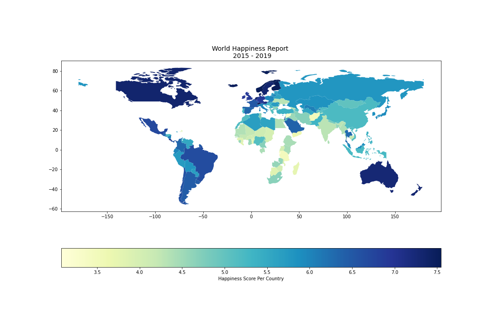

# Project Intro

As a global society, we are waking up to the fact that happiness in our daily lives is extremely important. The positive effects of a balanced mind spread not only throughout a person's life, but also throughout society in a stone-in-the-pond figure of speech.
Corporations, governments, and organisations are becoming increasingly aware of the importance of happiness. It could be noted that when minimum satisfaction standards are reached people are better able to contribute to their day to day lives and respective duties, and that it is also in their best interests to contribute to people's well-being. As a result, satisfaction metrics are constantly being used in policy decisions all around the globe.
The World Happiness Report is a publication of the Sustainable Development Solutions Network, powered by data from the Gallup World Poll and Lloyd’s Register Foundation, who provided access to the World Risk Poll.
The purpose of this project is to dive in and analyse the happiness score per country around the world and the main characteristics of what forms “Happiness”.

# Project structure

project 
|__ .gitignore          # gitignore file
|       
| 
|__ Resources/               # contains raw and cleaned data
|   |__ 2015.csv         # raw data
|   |__ 2016.csv         # raw data
|   |__ 2017.csv         # raw data
|   |__ 2018.csv         # raw data
|   |__ 2019.csv         # raw data
|   |__ AverageHappiness_Region.csv     # cleaned data
|   |__ Country_output.csv              # cleaned data
|   |__ AverageHappiness_Region.csv     # cleaned data
|
|__ notebooks/
|   |__ Data_Cleanup_and_Exploration.ipynb  # cleaning notebook that takes in the raw data and outputs cleaned data for analysis
|   |__ Final_data_analysis.ipynb  # analysis notebook that contains charts
|   |__ WHA_Country.ipynb  # analysis notebook that contains charts 
|   |__ WHA_Region.ipynb  # analysis notebook that contains charts 
|
|__ images/             # contains snippets from jupyter notebook
|
|__ project/
|   |__World Happiness Report.pptx     # project presentation

# Usage

## Activate environment
source activate PythonData

## install geopandas
pip install geopandas

## install seaborn
pip install seaborn

# Questions 

1. Where are the ten Happiest Countries in the world?
2. Why are they the Happiest Countries? 
3. Where does Australia rank in the world? 

# Datasets 

|No|Source|Link|
|-|-|-|
|1|Kaggle Open Source Datasets|https://www.kaggle.com/datasets|

# Analysis

### Question 1: Where are the ten Happiest Countries in the world? 

The top 10 happiest countries on average from 2015 to 2019 are:
- Denmark 
- Norway
- Finland
- Switzerland
- Iceland
- Netherlands
- Canada
- Sweden
- New Zealand
- Australia

### Question 2: Why are they the Happiest Countries? 

There are 6 variables that the happiness score is calculated from. Government Trust, Generosity, Health, Family, Economy (GDP per Capita) and Freedom. We found the happiest countries had high scores in Health, Family and Economy. 

### Question 3: Where does Australia rank in the world? 

Australia sits above the avegarge mean for the 6 variables that are used to calculate the happiness score.  

# Contributors

- [@Bec](https://github.com/Bec-Gould)
- [@Alysha](https://github.com/alysnow)
- [@Ernest](https://github.com/KenyanBoy)
- [@Alvin](https://github.com/Alvin1359)

