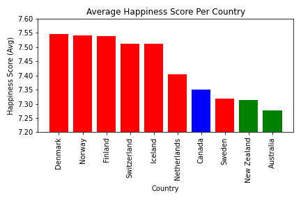
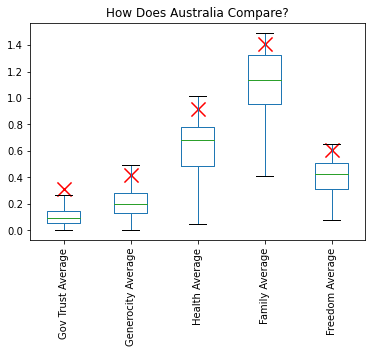

# Project Intro

As a global society, we are waking up to the fact that happiness in our daily lives is extremely important. The positive effects of a balanced mind spread not only throughout a person's life, but also throughout society in a stone-in-the-pond figure of speech.  
Corporations, governments, and organisations are becoming increasingly aware of the importance of happiness. It could be noted that when minimum satisfaction standards are reached people are better able to contribute to their day to day lives and respective duties, and that it is also in their best interests to contribute to people's well-being. As a result, satisfaction metrics are constantly being used in policy decisions all around the globe.  
The World Happiness Report is a publication of the Sustainable Development Solutions Network, powered by data from the Gallup World Poll and Lloyd’s Register Foundation, who provided access to the World Risk Poll.  
The purpose of this project is to dive in and analyse the happiness score per country around the world and the main characteristics of what forms “Happiness”.


## Project structure
```
project  
|__ Images/                                 # contains output graphs from jupyter notebook  
|
|__ Resources/                              # contains raw and cleaned data  
|
|
|__ .gitignore                              # gitignore file      
|
|__ Data_Cleanup_and_Exploration.ipynb      # contains data collection, cleanup and exploration
|
|__ Final_data_analysis.ipynb               # contains final analysis used in presentation
|
|__ WHA_Country.ipynb                       # contains analysis by country
|
|__ WHA_Region.ipynb                        # contains analysis by region
|  
|__World Happiness Report Presention.pptx   # project presentation  
```
## Datasets 

|Source|Link|
|-|-|
|Kaggle World Happiness Report|https://www.kaggle.com/unsdsn/world-happiness|


## Install Modules and Libraries
```
pip install geopandas   
pip install seaborn
``` 
```
import matplotlib.pyplot as plt
import numpy as np
import pandas as pd
import scipy.stats as st
import seaborn as sns
import geopandas as gpd
```
## Hypothesis
- H0: Happiness has no relationship with Economy (GDP per capita)


## Questions 

1. Where are the ten Happiest Countries in the world?
2. Why are they the Happiest Countries? 
3. How does Australia compare to other countries?


## Analysis

### Question 1: Where are the ten Happiest Countries in the world? 


The top 10 happiest countries on average from 2015 to 2019 are:
- Denmark 
- Norway
- Finland
- Switzerland
- Iceland
- Netherlands
- Canada
- Sweden
- New Zealand
- Australia



### Question 2: Why are they the Happiest Countries? 


- There are 6 variables that the happiness score is calculated from. Government Trust, Generosity, Health, Family, Economy (GDP per Capita) and Freedom. 
- We found the happiest countries had high scores in Health, Family and Economy. 

### Question 3: How does Australia compare to other countries?



- Australia sits above the avegarge mean for the 6 variables that are used to calculate the happiness score.  


### Hypothesis: Does Economy (GDP Per Capita) correlate with happiness score? 


- Analysis shows r-value = 0.6683439315322106, indicating there is a positive relationship between economy and happiness score
- Analysis shows p-value = 6.992878703186441e-35 < 5%
- We reject null hypothesis and accept alternate hypothesis
  - H1: Happiness does have a relationship with Economy (GDP per Capita)


### Possible Outcomes
- Governments can cater policies around ensuring:
  - good economic output
  - providing social support for people
  - investing in health sectors
- This is to ensure a country stays happy (could aid in maintaining government leadership)

# Contributors
- [@Alvin](https://github.com/Alvin1359)
- [@Alysha](https://github.com/alysnow)
- [@Ernest](https://github.com/KenyanBoy)
- [@Bec](https://github.com/Bec-Gould)

